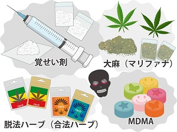

## 薬物依存症について
10335 村上　大岳

---

## 違法薬物とは
	
法律によって所持や使用、売買が禁止されている薬物のこと。
健康や社会生活に深刻な悪影響を及ぼすため、厳しく規制されています。
違法薬物の使用は、身体的・精神的な依存を引き起こし、犯罪や事故の原因となることもあります。

---

## 違法薬物の代表例

代表的な違法薬物には、覚醒剤、大麻、コカイン、MDMA（エクスタシー）、ヘロインなどがあります。これらの薬物は、短期間で強い快感や興奮をもたらしますが、長期的には健康を損ない、依存症や精神障害を引き起こす危険性があります。

---

## 違法薬物を使用するとどうなるのか

---

## 違法薬物を使用してしまうきっかけ

違法薬物を使用してしまうきっかけは様々です。友人や知人からの誘い、ストレスや悩みからの逃避、好奇心などが挙げられます。また、インターネットやSNSを通じて薬物に関する情報が簡単に手に入ることも、若者の薬物使用の増加につながっています。薬物の危険性を正しく理解し、安易に手を出さないことが重要です.

---
